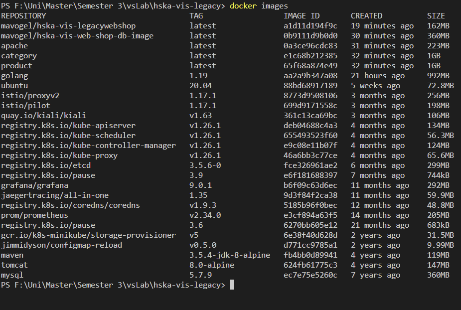
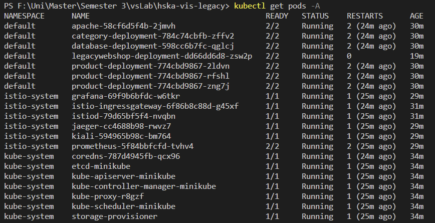
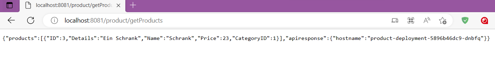
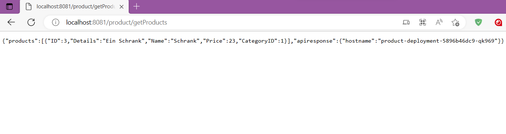
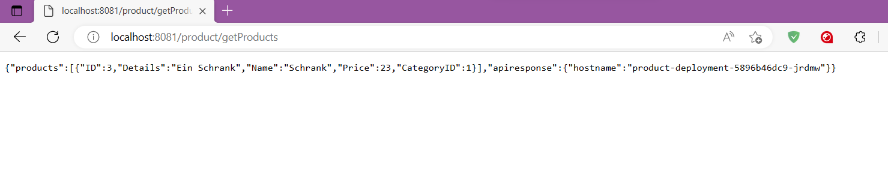
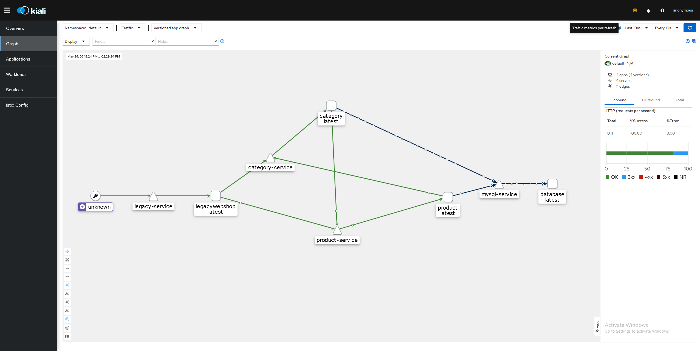
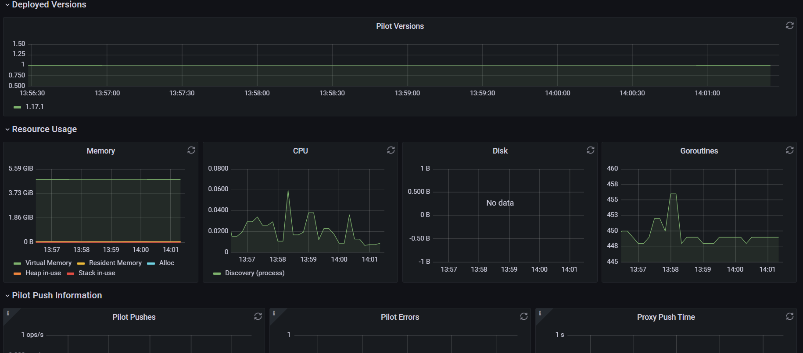

[](http://opensource.org/licenses/MIT)
[](https://travis-ci.org/mavogel/hska-vis-legacy)

# Distributed Information Systems Laboratory aka vis-lab
This project is the quick setup of the legacy webshop of 
the masters course 'Distributed Information Systems' at the University of Applied Sciences (Karlsruhe).

## Table of Contents
- [Prerequisites](#prerequisites)
- [Usage](#usage)
    - [Quick Start](#quick-start)
    - [Built it on your own](#built-it-on-your-own)
- [Database cleanup](#database-cleanup)
- [License](#license)

## <a name="prerequisites"></a>Prerequisites
- [docker](https://docker.com)
- with `docker-compose`

## <a name="usage"></a>Usage
You can run the images from `docker hub` which is preferred or built it on your own.
First: Start Docker daemon and check with `docker ps`

### <a name="quick-start"></a>Quick Start (docker-hub)
- Copy the `docker-compose.yml` locally in a desired folder and run
```bash
$ docker-compose up -d
# to follow the logs
$ docker-compose logs -tf
# to shutdown
$ docker-compose down
```

### <a name="built-it-on-your-own"></a>Built it on your own
- Run `docker-compose -f docker-compose-local.yml up -d` which will
    - It builds the web app `war` in a staged build, packs it into a docker tomcat8 container,
    and sets the user `tomcat` with password `admin` for the Management Console at http://localhost:8888/
    - Initializes the MySQL Database docker container with the db user defined in `hibernate.cfg.xml`
    - Sets up both containers and make the legacy webshop available under http://localhost:8888/EShop-1.0.0
- Follow the logs via `docker-compose -f docker-compose-local.yml logs -tf`
- To shutdown the containers run `docker-compose -f docker-compose-local.yml down`

## <a name="database-cleanup"></a>Database Cleanup
If you change the user and password of the MySQL database, you should run
```bash
$ docker-compose rm -v
$ rm -rf .data
```
Details can be found [here](https://github.com/docker-library/mysql/issues/51)

## <a name="license"></a>License
Copyright (c) 2017-2018 Manuel Vogel
Source code is open source and released under the MIT license.


# Report


## Deployment guide
this setup aims to work with minikube based on windows.


### start minikube

```bash
# start minikube with 16GB of ram and 4 cpus
minikube start --memory=16384 --cpus=4
```

### get ressources
```bash
# base git with mysql and legacy webshop
git clone https://github.com/HuBaX/hska-vis-legacy.git

# category microservice git
git clone https://github.com/HuBaX/CategoryService.git

# product microservice git
git clone https://github.com/HuBaX/ProductService.git
```

### build microservices
to build in minikube use in windows:
`& minikube -p minikube docker-env --shell powershell | Invoke-Expression`

```bash
# build product service
cd ProductService/
docker build -t product .
cd ..


# build category service
cd CategoryService/
docker build -t category .
cd ..

# build apache and mysql
cd hska-vis-legacy/
docker build -t apache -f .\docker\DockerfileApache .

docker build -t mavogel/hska-vis-web-shop-db-image -f .\docker\DockerfileMySQL .

docker build -t mavogel/hska-vis-legacywebshop -f .\docker\Dockerfile .

```

### deployment
Run the deployment yamls from the yaml-folder in the minikube cluster.

```bash
cd hska-vis-legacy/
kubectl apply -f ./yaml/mysql/
kubectl apply -f ./yaml/deployment/
kubectl apply -f ./yaml/services/
```

Check if everything is up and running.

```bash
kubectl get pods
```

### installation of istio
see: (https://youtu.be/voAyroDb6xk)
1. install istioctl(in admin powershell!):
```bash
choco install istioctl
```
alternative see: https://istio.io/latest/docs/setup/getting-started/

2. install istio
```bash
istioctl install
```
3. configure Envoy Proxy injection
create labe fro istio for default namespace
```bash
kubectl get ns default --show-labels
kubectl label namespace default istio-injection=enabled
kubectl get ns default --show-labels
```
(delete label with:  `kubectl label namespace default istio-injection-`)

4. delete all deployments and redeploy

```bash
# delete all
kubectl delete -f ./yaml/services/
kubectl delete -f ./yaml/deployment/
kubectl delete -f ./yaml/mysql/


# redeploy all pods
kubectl apply -f ./yaml/mysql/
kubectl apply -f ./yaml/deployment/
kubectl apply -f ./yaml/services/
```

### install Grafana, Prometheus and kaili addons for istio
0. copy the yaml files from istio addon folder to yaml folder istio-addons
(get files from latest release: https://github.com/istio/istio/releases)

1. apply the yaml files
```bash
kubectl apply -f ./yaml/istio-addons/
```

2. portforward kiali service

get service port from kiali: `kubectl get svc -A`

```bash
kubectl port-forward svc/kiali -n istio-system 20001
```

3. visit Kiali frontend at localhost:20001

4. portfoward Grafana service

get service port from kiali: `kubectl get svc -A`

```bash
kubectl port-forward svc/grafana -n istio-system 3000
```

5. visit Grafana frontend at localhost:3000


### Make shop visible

1. minikube service

```bash
minikube service legacy-service --url
```

2. go to url and port and add /EShop-1.0.0 to it

3. login with: 
    user: admin
    pwd: admin


## Report Screenshots 
In this section we provide screenshots for the different frontends and the work of the load-balancer.

### Minikube and Docker images
- output from list all docker images on the system
    
- output from list all pods in all namespaces on the minikube
    

### Load balancer
1. First GetProduct request

2. Second GetProduct request

3. Third GetProduct request


All hostnames are different! -> The load-balancer is working accordingly. 

### Kiali and Grafana

- Screenshot of Kiali after generating some traffic on the webshop
    
- Screenshot of Grafana(istio-control-plane-dashboard) after generating some traffic on the webshop
    

