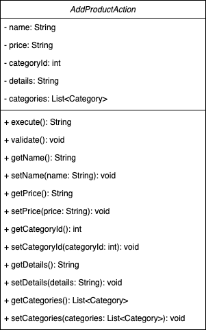
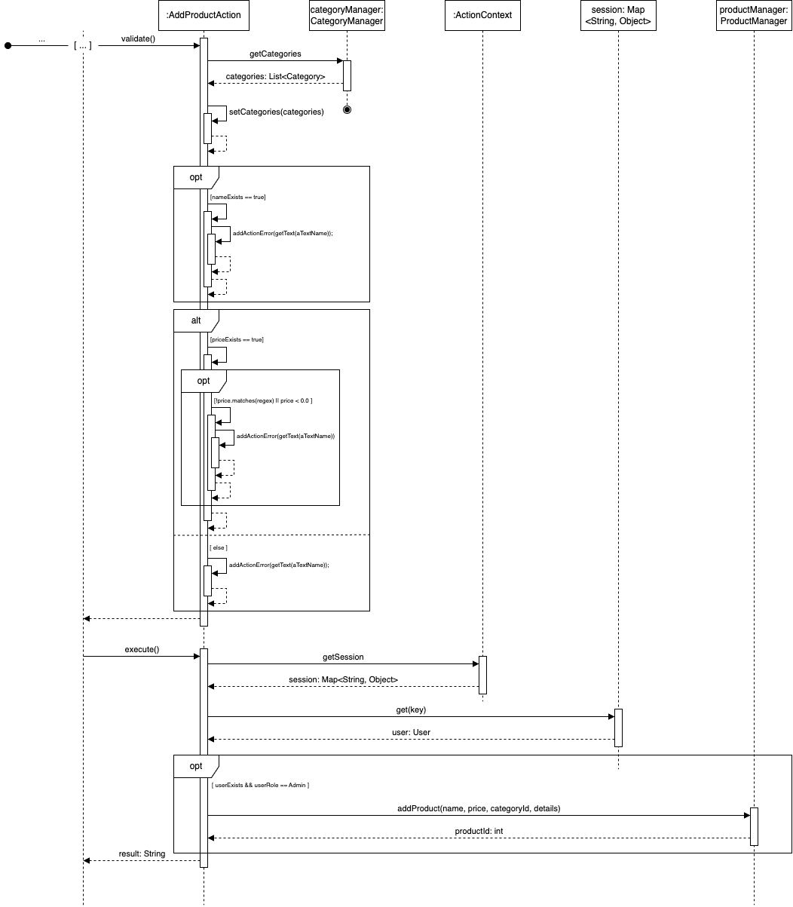
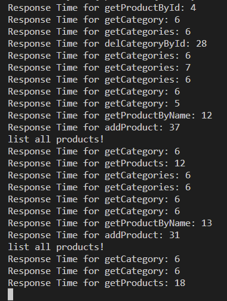

# VS-Lab - eShop Report

`Gruppe(IZ-Kürzel): krse1019, krse1020, rufl1020, wigo1011`

## Aufgabe 1
### 1. Aufgabe

#### Class Diagram

---

### 2. Aufgabe

>Analysieren sie Struktur und Verhalten des eShop --> c - Erstellen sie ein UML Strukturdiagramm (zB Klassendiagramm) und ein UML Verhaltens- diagramm (zB Sequenzdiagramm).

---

### 3. Aufgabe

>Erstellen sie ein fachliches Makro-modell des eShop mit DDD --> e - Diskutieren sie die Auswahl eines Bounded Context für die Migration als Microservice.

Es ist sinnvoll einen Bounded Context zu migrieren, weil dieser einen in sich geschlossene Domäne repräsentiert und somit keine Überschneidung mit Komponenten aus dem Legacy System hat.

Wenn man sich das Strangler pattern als Vorgehen aussucht, wäre es am sinnvollsten die Komponenten zu migrieren, die am häufigsten von den Entwicklern geändert werden müssen. Komponenten die vielleicht gar nicht mehr geändert werden müssen, können sogar in manchen Szenarien als Legacy System bestehen bleiben. So oder so muss wenn die Migration Schrittweise erfolgt eine Schnittstelle zwischen legacy System und den neuen Microservices geschaffen werden.

---

## Aufgabe 2
Architekturskizze des Webshops in Docker-Containern. 

---

## Augabe 3 

In diesem Abschnitt finden Sie Screenshots zu den verschiedenen Frontends und der Arbeit des Load-Balancers.

### Minikube und Docker images
- Ausgabe der Liste aller Docker images auf dem System

    
- oAusgabe der Liste aller Kubernetes Pods aus dem Minikube

    

### Load-Balancer
1. Erster ProductRequest

2. Zweiter ProductRequest

3. Dritter ProductRequest

Alle Hostnamen sind unterschiedlich! -> Der Load-Balancer funktioniert wie erwartet. 

### Kiali und Grafana Dashboards

- Screenshot von Kiali nach Generierung von Traffic auf dem Webshop

    

- Schreenshot von Grafana(istio-control-plane-dashboard) nach Generierung von Traffic auf dem Webshop
    
    
---

## Aufgabe 4

Performancetest Ergebnisse der Responsetime der verschiedenen Requests.

### Avarage Response-Time

| Action    | Called Action | Avg. Response Time |
| ---       | ---               | ---               |
| open add-Product Tab | getCategories() |6ms |
| add new product | addProduct() | 35ms |
| list all products | getProducts() | 45ms |
| edit categories | getCategories() | 5ms |
| add new category | addCategory() | 8ms |
| delete categorie | delCategoryById() | 14ms |
| delete product | deleteProductById() | 8ms |
| search product | getProductForSearchValues() | 13ms |

